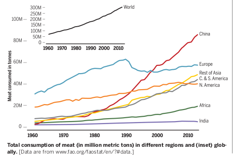

title: opinion: Meat Consumption: Good or Bad?
date: 2021-03-22 10:20
modified: 2021-03-22  10:20
category: Opinion
tags: opinion, society
slug: meat consumption
authors: Julien Hernandez Lallement
summary: Quick research-based report on meat consumption
illustration: 2021_03_meat.jpg

In August 2020, the most important event of my life so far happened: I got my first baby :) Matteo was born on August 23rd
and it has been a blessing (95%) and a sleep disruptor (5%) since then. OK, more like 90/10 ;)

Breast fed, the first months were quite worries-free when it came to nutrition. Quite fast, some people asked "when are you
starting with more solid food?". WHO [recommends](https://www.who.int/news-room/fact-sheets/detail/infant-and-young-child-feeding)
to start at approximately 6 months old with that. I did not do research background, and simply trusted that information.

Now, other people asked, knowing that I am vegetarian, "what will you do about meat?". Good question. My wife, being an
occasionally meat eater, also worried that meat might be important for infant growth, which is a valid concern of course.

After some weeks of procrastination, the time has come for little Matteo to eat other food than breast milk, and while carrots
and sweet potatoes are being smashed in the kitchen, I sat at the computer doing some research. I thought I would write about 
this as a source to give people that question my dietary decision, which I knew, and now can prove, makes sense (sort of).

A few points before I start: 
* This article focuses on the benefits of eating or not eating meet from an **individual** perspective. I won't discuss
here the problems raised by vegetarians that eat kilograms of rice from far away lands & tons of soja that required
  much water to be harvested; same goes for meat eaters that import Kobe beef or Argentinan rumsteak that came not only at
  great expense to produce the meat, but to move it across lands. These concerns are perfectly valid, but outside the scope of this opinion piece.
   
* This article is strongly based on [this](https://science.sciencemag.org/content/361/6399/eaam5324) and [this](https://europepmc.org/article/med/20374748)
article, which I found great in reviewing the current state of the art.

Let's start with some general numbers. See [here](https://science.sciencemag.org/content/361/6399/eaam5324) for reference.
Meat consumption is raising at high pace (Figure 1). 

**Figure 1 |** Some numbers on meat consumption world wide. 
From [Godfray et al. 2018](https://science.sciencemag.org/content/361/6399/eaam5324)

While the methodology to measure meat consumption is multi folded, most of them concur in concluding that meat consumption 
has increased globally, in particular in Asia, South America and to a minor extend, in Africa. Using available [data](http://www.fao.org/faostat/en/?#data),
studies estimated an average global consumption of meat of approximately 122 g/day (mostly pork & poultry, but also beef, 
sheep, goats, and other animals).
Using well [established estimators](https://www.cambridge.org/core/journals/public-health-nutrition/article/nutrition-transition-and-its-health-implications-in-lowerincome-countries/F5380EB56C936722B4D55FB4E1F4BDAF),
studies suggest a *"rise in wealth will lead to an increase in meat consumption of ~100% between 2005 and mid-century"* (see [here](https://www.pnas.org/content/108/50/20260)).
While other reports (see [here](http://www.fao.org/fileadmin/templates/esa/Global_persepctives/world_ag_2030_50_2012_rev.pdf) for 
UN report that concludes on a 76% increase) use other methodology, all concur that meat consumption is likely to rise in the coming
decades.

What drives meat consumption? Well that is a fascinating question I think, but outside the scope of this article. See [here](https://royalsocietypublishing.org/doi/10.1098/rsta.2016.0371) 
& [here](https://www.foodpolitics.com/food-politics-how-the-food-industry-influences-nutrition-and-health/) for starting references. 
I'm considering writing another article related to meat consumption motivation & drivers, because this might help some readers
and interlocutors reflect on their dietary model. Oh and see [here](https://vegstudies.univie.ac.at/fileadmin/user_upload/p_foodethik/Ruby__M._et.al._2015.04__Rationalizing_meat_consumption._The_4Ns_richtig_zuerst_Piazza__Jared.pdf)
for a last cool reference on the matter.

**Effects of meat consumption**  
Given the premise that meat consumption is high, increasing, and likely to increase over the coming decades, I will go 
through a series of findings that support or not the consumption of meat. Note that fish and sea animals are excluded
from analysis in this article. I will do some additional research regarding toxicity level, but have little time lately...

*Health Effects*  
Measuring effects of meat consumption on human health is very tricky. Maybe the most typical approach is to run  
prospective epidemiological cohort studies that involve a high number of participants (>20.000) to monitor
dietary intakes and health status over years. In turn, the data allows to identify relationships between meat consumption and
the emergence of diseases. 

As if that was not challenging enough, another issue is that, while a study on its own might be valid, it is important to take a meta-analytical perspective,
as I argued in another [post](https://juls-dotcom.github.io/meta_analysis_intro.html), which might and **should not** combine studies using
different methodologies. This makes it even more complicated to obtain meta-analytic observations on meat consumption.

Despite these challenges, it is well known that meat is a good source of energy which contains essential nutrients, 
including protein and micro-nutrients such as iron, zinc, and vitamin B12. However, all of these nutrients can be obtained
through other food sources if planed carefully, as illustrated by a large proportion of the highly vegetarian indian population, 
which, by the way, show decrease cardiovascular diseases as non-vegetarian equivalent population (see [here](https://journals.plos.org/plosone/article?id=10.1371/journal.pone.0110586)).
But more of that below.

It should be said that animal products can make a positive difference in some low income countries where other food source are 
not readily available. See [here](https://apiycna.org/wp-content/uploads/2014/01/The-importance-of-milk-and-other-animal-source-foods-for-children-in-low-income-countries.pdf)
or [here](https://www.scibey.com/articles/22030314/is-animal-flesh-consumption-associated-with-better-iron-status-among-adults-in-d),
although the latter study stated that further longitudinal studies are required for confirmation.

In Western countries, mortality rates are higher in subjects who regularly eat red and processed compared to lower intake
subjects (not necessarily vegetarians). Interestingly I found no or moderate increase in health risk was observed for 
the consumption of poultry. See [here](https://bmcmedicine.biomedcentral.com/articles/10.1186/1741-7015-11-63), [here](https://www.bmj.com/content/357/bmj.j1957)
and [here](https://jamanetwork.com/journals/jamainternalmedicine/fullarticle/414881). 
A few words of [caution](https://science.sciencemag.org/content/361/6399/eaam5324):  
* Be careful, not all studies use a vegetarian population as comparison. The second study for instance concluded that  
white meat intake reduced health risks, but the comparison was made with read and processed meat eaters, not vegetarians.
* Note as well that the increase in health risk was modest and not drastic. However, still statistically significant.  
* Finally, high meat intakes can be comorbid with other major risk factors such as smoking, alcohol consumption, 
and obesity and all studies did not necessarily control for these factors.   
  
While the association between red meat and healt issues remains modest, one clearly demonstrated relationship is the one between processed meat, 
(and to some extend red meat) with colo-rectal cancer (Figure 2). As a matter of fact, processed meat is classified as carcinogenic to humans, 
while red meat is classified as probably carcinogenic (see [here](https://www.thelancet.com/journals/lanonc/article/PIIS1470-2045(15)00444-1/fulltext)).
Processed meat consumption is also associated with other diseases, such as diabetes and cardiovascular diseases, which is not the
case (to my knowledge) for read meat. Note that a thorough [article](https://europepmc.org/article/med/20374748) (from 2010, so already old)
reviewed several articles claiming an association between red meat and multiple diseases, and found a series of methodological limitations such as cooking methods 
(processed meat) and combining different animals together. I do not have time to run quality checks on the studies though...And that is unfortunate.

**Figure 2 |** Increased risk of health issues with increasing volume of processed meat intake.
From [Godfray et al. 2018](https://science.sciencemag.org/content/361/6399/eaam5324)

It should be noted that published work that used modeling trained on real world data found conclusions that went along
with what I mentioned earlier. Transfering from meat- to plant-based diet is foreseen to reduce risk of cardiovascular diseases
(see [here](https://www.ahajournals.org/doi/10.1161/CIRCULATIONAHA.109.915165)), stroke (see [here](https://www.ahajournals.org/doi/10.1161/STROKEAHA.111.633404)),
and diabetes (see [here](https://academic.oup.com/ajcn/article/94/4/1088/4598110)), 
reducing overall mortality by 6 to 10% (see [here](https://www.pnas.org/content/113/15/4146)).
Interestingly, the last article cited here also looked at environmental effects of meat consumption, and concluded positive
effects on climate change driven by overall dietary change. More of that below.

**My Conclusions on Health Effects**  
What I take from this is that processed meat and most likely read meat are linked to a series of diseases that could emerge
in mid to later lifetime. While these causal links are quite hard to identify, several studies have concurred in such
associations, which require nonetheless more scrutiny and more powerful statistical approaches (Bayesian statistics have
been used in one of the study, which, thanks to the concepts of prior, could increase accuracy of the findings).   

Personally, these findings have convinced me that processed and probably red meat is overall deleterious for the health. 
I will not propose such food to my son at home, and will instruct related people to not propose it outside of home. 
That poultry does not seem associated with health issues will not change my behavior: I remain vegetarian, for other reasons
than sole health. However, my principles will not necessarily be the ones of my son, and we decided that he would be allowed
consume poultry if he wants, while outside of home (related family for example).
This is a tricky issue though, and I will remain informed to make sure I am not taking a dangerous path for my son.

*Environmental Effects*  

OK, so my wife & I concluded that we would forbid processed and red meat at all levels, while allowing poultry outside of home.
That was based on health criteria, as discussed before.

What about other effects of eating poultry, as well as eggs, milk & other animal derived products (I am not a vegan)?

One of the most obvious effect that has been discussed recently is the environmental impact that animal stocks have on 
the planet. Poultry produces less emissions than ruminants (see [here](http://www.fao.org/3/a0701e/a0701e.pdf) or 
[here](http://www.fao.org/policy-support/tools-and-publications/resources-details/en/c/1235389/)). OK, good for us. But still,
how much does it produce?

**Figure 3 |** Meat production and Green House Gases.
From [Godfray et al. 2018](https://science.sciencemag.org/content/361/6399/eaam5324)

Above, you can see the percentage of total Green House Gases (GHGs) emissions for the period between 2005/2007 and the projections
for 2050. By limiting our consumption to poultry & dairy, I read that I would be contributing to ~2% of the total human 
emissions. Acceptable? That's for each person to decide. Note however how dairy's contribution to emissions is higher than the
one for poultry.

What about other metrics? The same review that I am extensively using for this post also reported water use:

**Figure 4 |** Proportion of freshwater use per category. [Data](www.fao.org/nr/water/aquastat/main/index.stm) are from FAO AquaStat 2016
From [Godfray et al. 2018](https://science.sciencemag.org/content/361/6399/eaam5324)

As noted by the authors : *"Agriculture uses more freshwater than any other human activity, and nearly a third of this is
required for livestock"*. Loads of water then...And I am not mentioning the fact that retrieving "blue water" (eg, rivers) competes
with other activities or that forest are being cut down to plant crops to feed livestock...

Now again, it seems that, while there are strong fluctuations in water footprint depending
on the type of animals, *"[...] beef farming is more than three times as water intensive as chicken production per kilogram
of meat."* See [here](https://www.pnas.org/content/111/33/11996) for reference.
Again good for us I guess, but still the dairies should be added to this category as ruminant, not poultry...

**My Conclusions on Environmental Effects**  
We are trying to find a balance here between our health, out footprint and our happiness...Leaving poultry out of home, food orders
and school will make our children eat it, if they want to, maybe 15 days per year (gross calculation). We thought that the 
environmental footprint of it is acceptable.
Now dairy...they do seem to produce a lot of emissions and require ay lot of water. That's annoying because being half french,
I love love love cheese. But still, data is data, so we decided to limit cheese to week ends only. We already suppressed
milk due to digestive reasons, and use solely plant based milk.
<bb> 

*Ethical Aspects*  

There is also one important component in this decision which is Ethics. Is is oay to instrumentalize life for feeding reasons,
if (and as supported by science) we can survive perfectly fine without eating meat...That is for another post and up for debate
though, so I won't be going into details here. 
Feel free to reach out if you want my opinion on this matter though :)

**Overall Personal Conclusion** 

This is what we decided after reading out a bit on eating meat, from different perspective: 
 - For ethical reason, I do not eat meat. However, this is my decision and I do not want to impose it to my children. 
As long as eating something is not proven to be deleterious for health, the kids should be able to eat it as long as
   they eventually hear about and understand the consequences of their actions on other beings. 
 - Since processed and red meat seem associated with health issues, we ban them from the family diet. 
 - Since poultry does not seem associated with health issues, we let our children eat it, outside of home and in controlled 
environments (poultry need ot be healthy and raised in good and natural environment). 
 - We limit dairy products to week ends, to limit our contribution to ruminant livestock's emissions. 
 - We plan our children's diet carefully to make sure they obtain all required nutrients from a week's food intake. 

 
That's it! I'd be curious to hear about your opinions on my data-based decisions. Note that given the little time I have,
I spend approximately 8h of time to review some papers and put together some graphs and make decisions.
**This should not be taken as a thorough review of the meat consumption state of the art**
